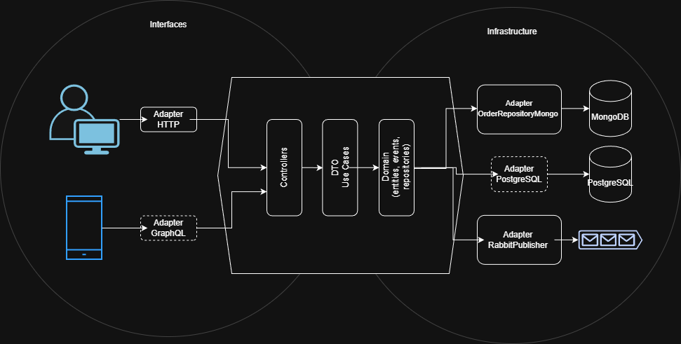

## Apresentação - Order Manager API [PT-BR]:
A Order Manager API foi desenvolvida em Node.js, utilizando o framework Express.js.
A aplicação segue a arquitetura hexagonal (Ports and Adapters), garantindo uma separação clara de responsabilidades entre as camadas:

- application (DTOs e use cases)
- domain (entities, events, repositories e services)
- infrastructure (database, HTTP e messaging)
- config (env.js)
- tests (testes unitários)

Para os testes unitários, foi utilizado o Jest, garantindo maior confiabilidade e manutenibilidade do código.

## Deploy LOCALHOST - Order Manager API [PT-BR]:
O deploy da aplicação em ambiente local pode ser realizado de duas formas: sem Docker ou via Docker.

Sem Docker (localhost):
```bash
  yarn dev
```

Com Docker:
- Certifique-se de que o Docker está instalado corretamente na sua máquina;
- Após a verificação, a aplicação do Docker deve estar aberta/em execução (ícone de baleia);
- Para realizar o primeiro deploy e a execução da API, digite o comando a seguir no terminal e clique em "Enter":
```bash
  docker compose up --build
```
- Esse processo pode demorar alguns minutos, e irá: criar e inicializar os containers Docker, executar o healthcheck do MongoDB e do RabbitMQ, instalar as dependências do projeto, iniciar a API.
- Com a API já em execução, qualquer dúvida sobre documentação, poderá consultar o endpoint: http://localhost:3000/api-docs - abrirá o Swagger da API.

## Escalabilidade - Order Manager API [PT-BR]:
A escalabilidade pode ser implementada de duas formas (inicialmente), horizontal e vertical.

- Na arquitetura horizontal poderíamos implementar um load balancer, como o NGINX, e disponibilizar várias instâncias da mesma API. O NGINX fazendo a gestão e distribuindo o tráfego dos dados;

- Na arquitetura vertical poderíamos aumentar a capacidade dos recursos mesmo. Pensando na AWS, por exemplo, poderíamos aumentar a memória RAM, CPU, disco/armazenamento do servidor responsável por armazenar nossa API. Porém, poderia ter o impacto negativo de custo aumentado.


## Arquitetura - Order Manager API [PT-BR]:

